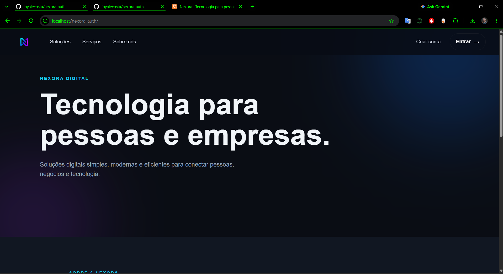

# Nexora Auth

Sistema de autenticação e portal do cliente desenvolvido como parte do ecossistema **Nexora Serviços Digitais**.

O projeto foi criado com foco no desenvolvimento de uma aplicação web organizada, segura e funcional, utilizando PHP e MySQL no backend e HTML/CSS na interface.

## Preview



## Sobre o projeto

O Nexora Auth permite realizar o fluxo básico de autenticação de usuários e acesso a uma área restrita.

Atualmente, o sistema possui:

- Cadastro de usuários
- Login com e-mail e senha
- Senhas armazenadas utilizando hash
- Validação de credenciais
- Sessões em PHP
- Área autenticada do cliente
- Exibição de dados da conta
- Página de serviços
- Logout e encerramento da sessão
- Interface responsiva seguindo a identidade visual da Nexora

## Tecnologias

- HTML5
- CSS3
- PHP
- MySQL
- PDO
- Git
- GitHub
- XAMPP

## Segurança

Algumas práticas utilizadas no projeto:

- `password_hash()` para armazenamento seguro de senhas
- `password_verify()` para autenticação
- Prepared Statements com PDO
- Sessões PHP para controle de autenticação
- `htmlspecialchars()` na exibição de dados
- Arquivos de configuração sensíveis protegidos pelo `.gitignore`

## Estrutura

```text
nexora-auth/
├── assets/
│   ├── css/
│   │   └── style.css
│   └── img/
├── config/
├── dashboard.php
├── index.php
├── login.php
├── logout.php
├── register.php
├── service.php
├── .gitignore
└── README.md
```

> O arquivo local de configuração do banco de dados não é versionado para evitar a exposição de credenciais.

## Banco de dados

O projeto utiliza MySQL.

A aplicação trabalha com uma tabela de usuários contendo informações como:

- ID
- Nome
- E-mail
- Senha
- Data de criação

## Identidade visual

A interface utiliza a identidade visual da **Nexora**, com uma proposta tecnológica e moderna baseada em:

- Dark mode
- Azul
- Ciano
- Roxo
- Gradientes
- Componentes responsivos

## Objetivo

O Nexora Auth faz parte do meu processo de desenvolvimento e evolução em aplicações web.

O projeto também representa uma das bases para o futuro ecossistema digital da Nexora, no qual autenticação, serviços e experiência do cliente poderão ser integrados em uma única plataforma.

## Próximas melhorias

- Validações adicionais no backend
- Melhorias nas mensagens de erro
- Recuperação de senha
- Tokens com expiração
- Evolução do portal do cliente
- Melhorias de acessibilidade
- Aprimoramento da responsividade
- Deploy em ambiente Linux

## Autora

**Joyce Costa**

Profissional de Tecnologia da Informação com experiência em infraestrutura, suporte e observabilidade, atualmente ampliando sua atuação em desenvolvimento web.

Desenvolvido como parte da **Nexora Serviços Digitais**.